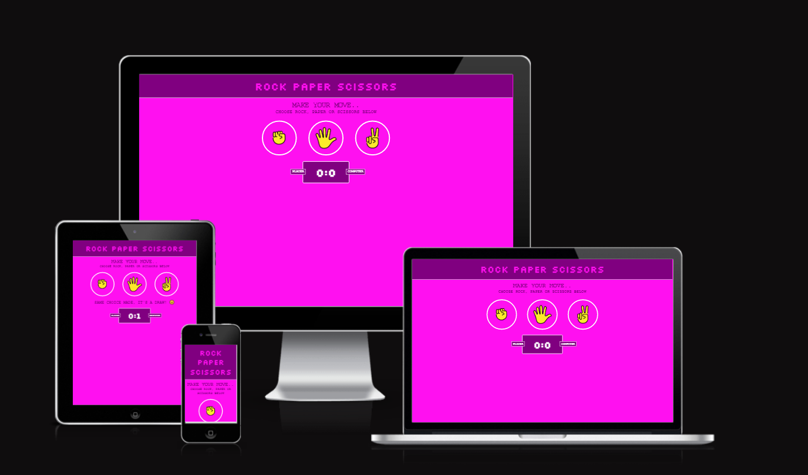
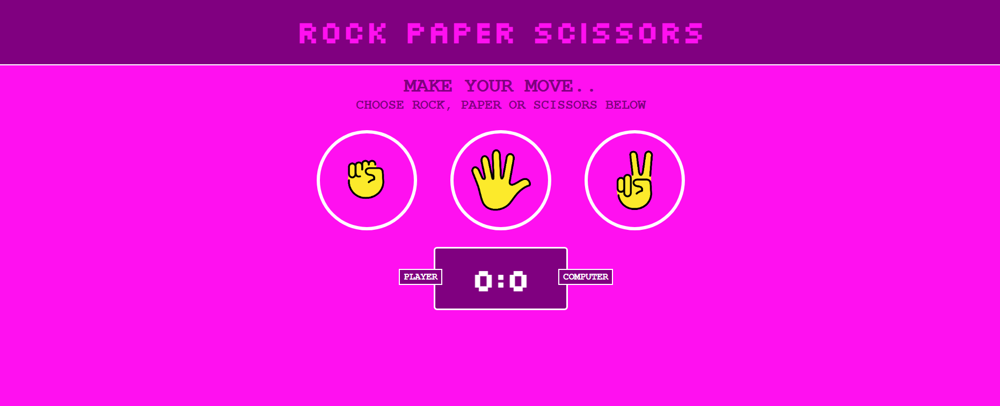
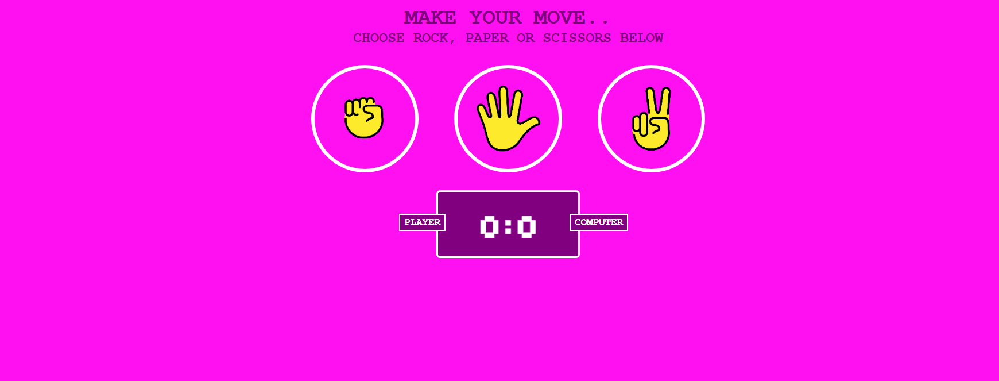
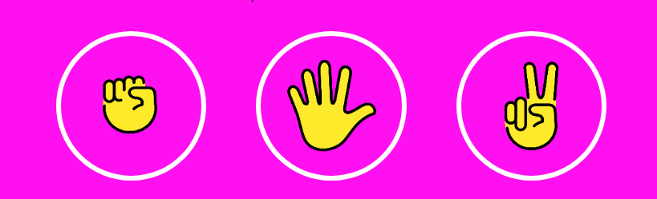
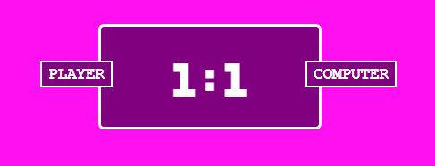
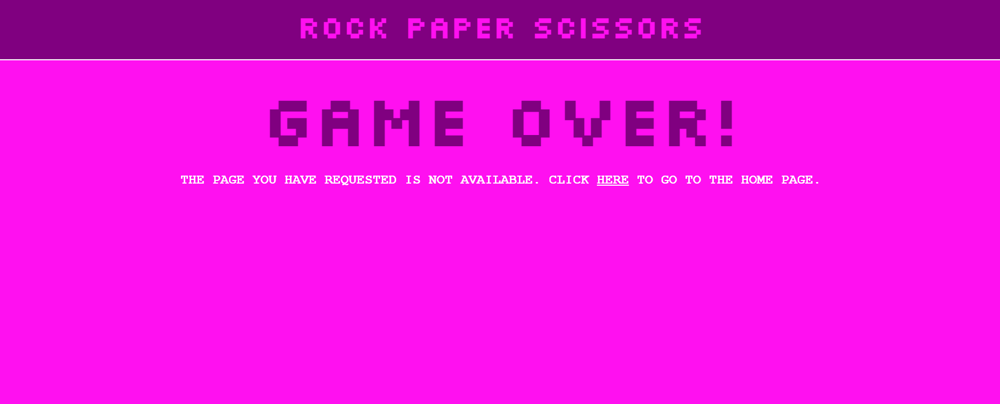
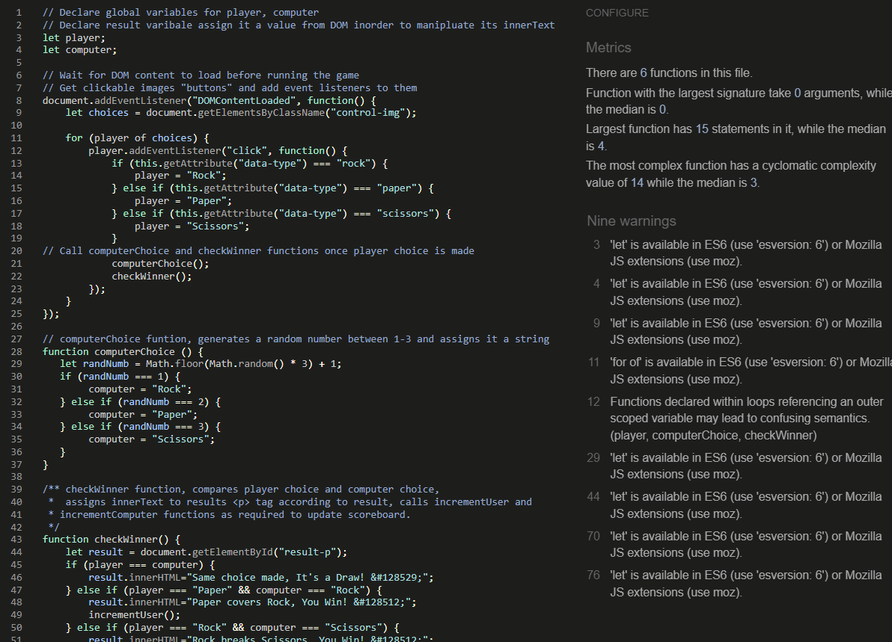

# Rock Paper Scissors

Rock Paper Scissors is a web application aimed at emulating the hand game of the same name loved by all ages. The application will be targeted towards all audiences who are looking to play the game when alone. With my 6 year old daughter (who has recently begun to play the game herself) specifically in mind, the application has been designated a colour scheme to appeal to her, for now.

The user initiates the game by making their choice, in turn the computer makes its choice and the user is notified of the result. A win or a loss results in the scoreboard being adjusted accordingly. Information is presented to the user through text and images which the user will also interact with.

In the future it is planned that the application will provide the user with the ability to create their own account, which will contain information such as streaks and futher game history, two-player mode (on-line and off-line). For now this idea has been confirmed as being out of the scope of the current project.

## Features 

### Existing Features

- __Landing Page__

  - The landing page provides the platform for the entire application. From here the user can view the Header and the Game Area. The user is directed by text cues as to how to play the game.

- __Header__

  - The header is styled in a consistant fashion across the application. Given the application consists of two pages (one to host the application itself and a 404 page, it was decided that a nav bar was not currently necessary. Nevertheless, it was still a priority to provide a consistant indication of what the application is to the user.

- __Game Area__

  - The Game Area is a section on the Landing Page and contains all the components for the the game itself. Instructions to the user to commence the game by making a move, clickable images to allow the user to make their selection, a results paragraph to indicate the result, and a scoreboard to keep track of the score and also further indicate the result.

- __Game Instructons__

  - This area indicates to the user how to proceed via permanent text cues.

- __Game Controls__

  - Here the user is provided with three images which are clickable. These images are styled with CSS to be familiar as a clickable button, they are rounded, change colour on mouse hover, with a further cue as to their clickable nature being the change of the curser from its default setting of an arrow to a pointer. 
  
  - When the user makes their choise of the three available, JavaScript is utilised to convert their choice from HTML to a string, which is then compared to a randomly generated computer choice (a random number between 1-3) which has also been converted to a string to represent the same three choices availables to the user.

- __Results Paragraph__

  - After the comparison is made the result is calculated using a "checkWinner" function which then populates the innerHTML of a paragraph tag directly below the Game Controls. This paragraph contains both text and emoji to convey the result to the user and is not visbile until after the user makes their first choice and the game commences.

- __Score Board__

  - Here the user is provided with the information on their current score vs the computer's score. As the scoreboard updates in real-time this is also a further cue to the user as to the result of their choice.

- __404 Page__

  - If the user navigates to a page that doesn't exist, they are redirected here. Informing the user that they have not reached their requested page. The user can follow the link to take them back to the applications main page without having to use the browers back button.

### Features Left to Implement

- User Profile (out of scope). In the future it is planned to implement further user functionality in the form of a user profile. This would afford the user the ability to maintain game history such and win/lose ratio, games played and in-game streak data.

- Online Gameplay (out of scope). Given the implementation of a user profile, further functonality could be added to allow the user to play against their friends rather than just the computer. 

## Testing

- Responsiveness
  - The site displays as intented on all screens. Tested using Developer Tools in Google Chrome Browser, Safari Browser and at https://ui.dev/amiresponsive

- Features
  - All of the features are working as intended. Once the page loads, and the user makes their choice, the computer then automatically makes its choice, these choices are then compared and the result in turn is relayed back to the user. The Score Board also is imcrementing as intended. If the user navigates to a page that doesn't exist, they are successfully redirected to a "404.html" error page. The link on this page which brings the user back to the main page is working as intended.

### Validator Testing 

- HTML
  - No errors were returned when passing through the official [W3C validator](https://validator.w3.org/nu/?doc=https%3A%2F%2Fdgdcosgrove.github.io%2Fci-pp2-rock-paper-scissors%2F)
- CSS
  - No errors were found when passing through the official [(Jigsaw) validator](https://jigsaw.w3.org/css-validator/validator?uri=https%3A%2F%2Fdgdcosgrove.github.io%2Fci-pp2-rock-paper-scissors%2F&profile=css3svg&usermedium=all&warning=1&vextwarning=&lang=en)
- JavaScript
  - Some warnings were found when passing through the JSHint linter
  

### Unfixed Bugs

There were no bugs found.

## Deployment 

- The site was deployed to GitHub pages. The steps to deploy are as follows: 
  - In the GitHub repository, navigate to the Settings tab 
  - From here, click on Pages link in left sidebar.
  - From the source section drop-down menu, select the Main Branch
  - Once the main branch has been selected, click save and the page will be automatically refreshed with a detailed ribbon display to indicate the successful deployment. 

The live link can be found here - https://dgdcosgrove.github.io/ci-pp2-rock-paper-scissors/

## Credits 

### Content 

- The HTML, CSS, JavaScript and text for all pages was written by Daniel Cosgrove.

### Media

- All images used on this project were sourced from 
[OpenMoji](https://openmoji.org/) and [W3C Schools](https://www.w3schools.com//)
